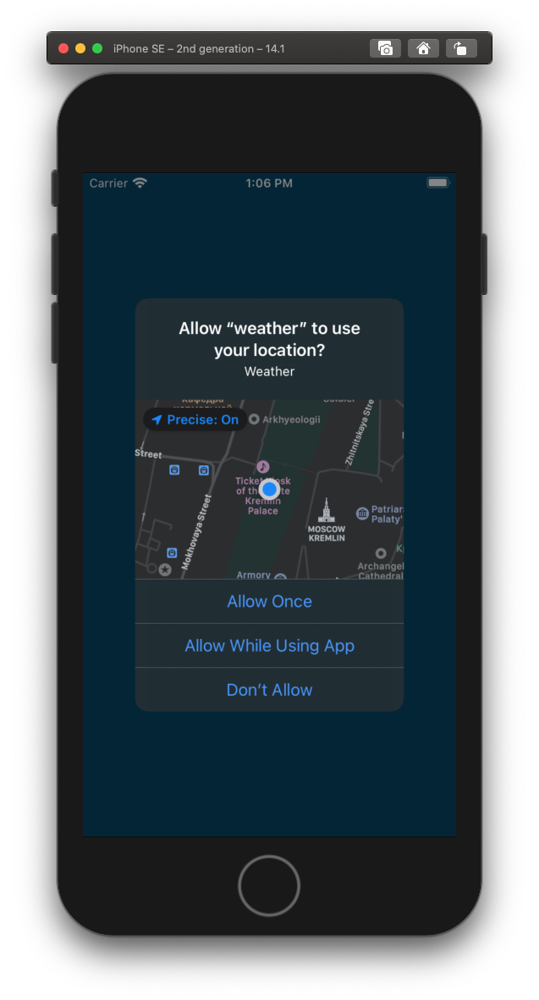
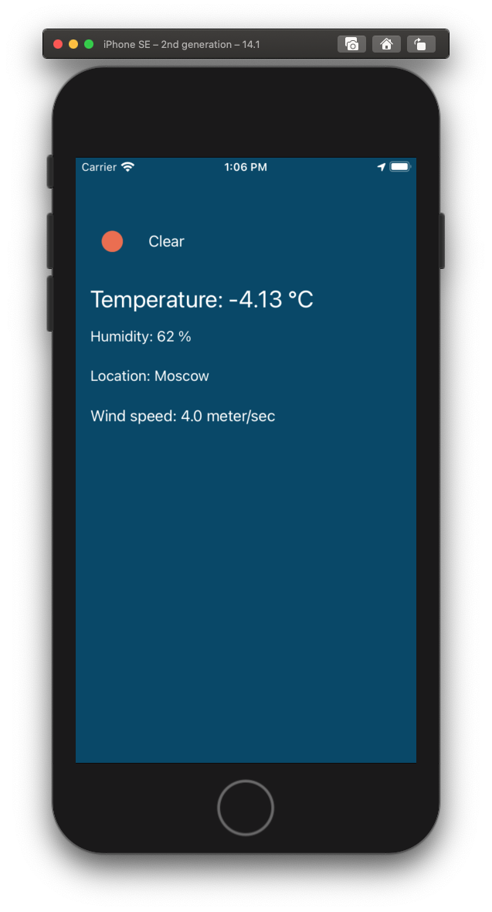

# weather - у природы нет плохой погоды

## Задание
### Написать приложение по отображению текущей погоды без использования сторонних библиотек
+ Температура
+ Влажность воздуха
+ Скорость ветра
+ Иконка с изображением погоды
+ Тёмный режим
## Screenshots
### Разрешение на доступ к геопозиции

-------------------------
### Просмотр данных

